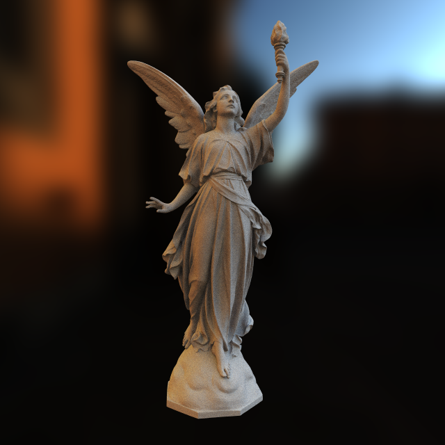

# teapot.lua

1 ray tracer written in pure lua, 1 file, 0 dependencies.

Made after taking [Computer Graphics (15462)](https://github.com/cmu462/Scotty3D) in 2019 at [CMU](https://www.cmu.edu/) and feeling not having had enough.

Supports:

- Bounding volume hierachy (BVH)
- Diffuse, Emission, Mirror, Glass, Glossy, SSS (subsurface scattering)
- Directional, point, area, hemisphere, ambient, environmental lights
- 2D Texture sampler

17 century silver teapot from China. 清雍正銀提梁壺
(modelled to be a slightly more interesting alternative to the canonical teapot [[.obj](models/silverpot.obj)]).

Another setup

Stanford dragon in a cronell box with glass ball.

Lucy in Pisa.

The canonical teapot in cornell box.

Jade dragon with subsurface scattering.

I lost most my renderings after a computer disaster, will render some more soon :P

## Usage

See `scenes` folder on how to contruct a scene and render it.

## File formats

[OBJ](https://en.wikipedia.org/wiki/Wavefront_.obj_file) for 3D models, [PPM](https://en.wikipedia.org/wiki/Netpbm) for input texture and output rendering. Included is a tool `tools/convert_ppm.py` for converting to PPM from PNG/JPG/EXR to PPM.
